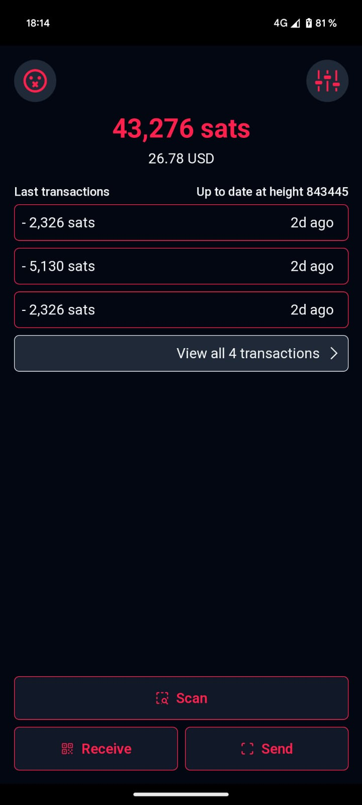
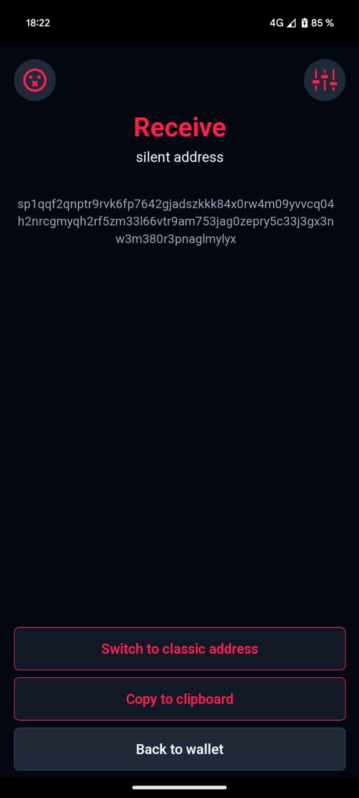
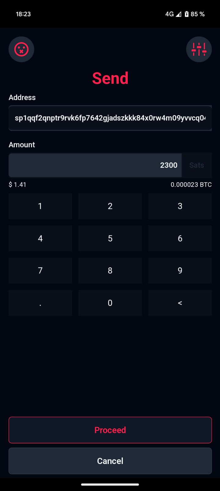

# Silentium wallet

Self-custodial & privacy focused wallet for sending and receiving Silent payments with [Silentiumd](https://github.com/louisinger/silentiumd).

> **This is an experimental project acting as a proof of concept for Silent Payments light wallets. Use at your own risk.**

    <a href="https://app.silentium.dev">app.silentium.dev</a>

    
    
    

## Design

- Mobile first Progressive Web App
- Self-custodial (no server owns your keys)
- Privacy focused (no tracking, no analytics, silentiumd can't track your utxos or transactions). Use compact block filter (BIP158) to fetch utxos and transactions.

## Development

This project was bootstrapped with [Create React App](https://github.com/facebook/create-react-app).

In the project directory, you can run:

### `yarn start`

Runs the app in the development mode.\
Open [http://localhost:3000](http://localhost:3000) to view it in the browser.

The page will reload if you make edits.\
You will also see any lint errors in the console.

### `yarn test`

Launches the test runner in the interactive watch mode.\
See the section about [running tests](https://facebook.github.io/create-react-app/docs/running-tests) for more information.

### `yarn build`

Builds the app for production to the `build` folder.\
It correctly bundles React in production mode and optimizes the build for the best performance.

The build is minified and the filenames include the hashes.\
Your app is ready to be deployed!

See the section about [deployment](https://facebook.github.io/create-react-app/docs/deployment) for more information.

## Acknowledgements

- [Silentiumd](https://github.com/louisinger/silentiumd) 
- Silent payments [BIP352](https://github.com/bitcoin/bips/pull/1458)
- Compact block filter for light clients [BIP158](https://bips.dev/158)
- [Helm wallet](https://github.com/bordalix/helm-wallet) by [bordalix](https://github.com/bordalix)

## License

<a property="dct:title" rel="cc:attributionURL" href="https://github.com/louisinger/silentium">silentium</a> by <a rel="cc:attributionURL dct:creator" property="cc:attributionName" href="https://github.com/louisinger">Louis Singer</a> is licensed under <a href="https://creativecommons.org/licenses/by/4.0/?ref=chooser-v1" target="_blank" rel="license noopener noreferrer" style="display:inline-block;">Creative Commons Attribution 4.0 International</a>

